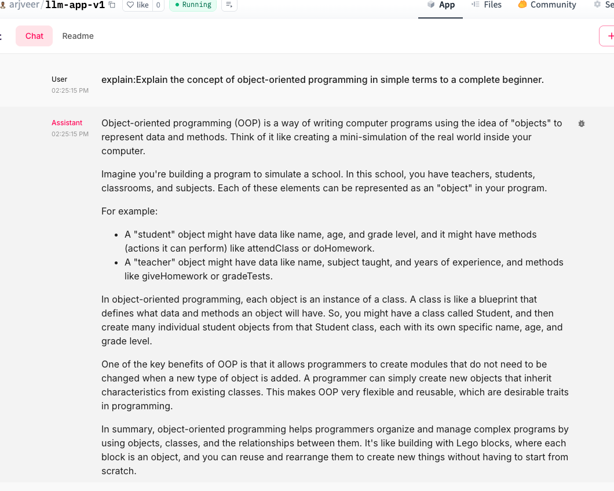
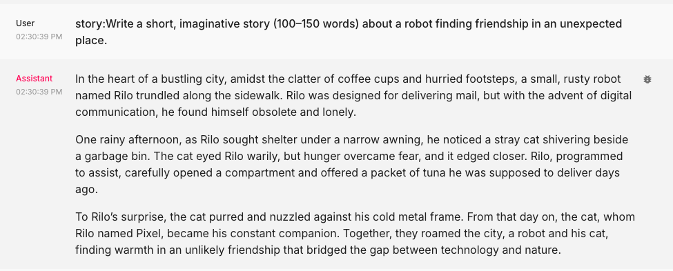
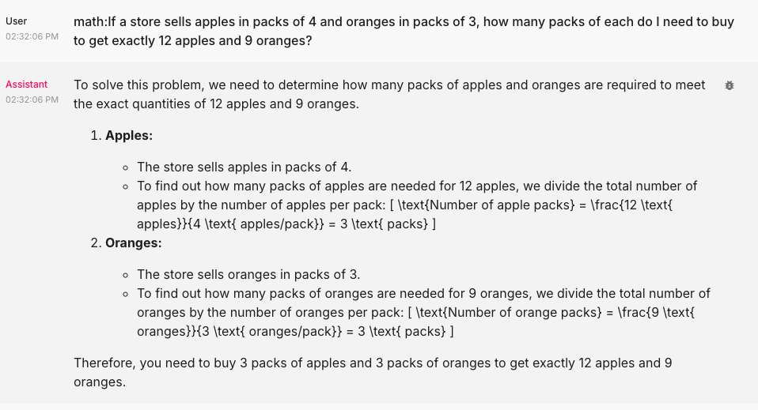
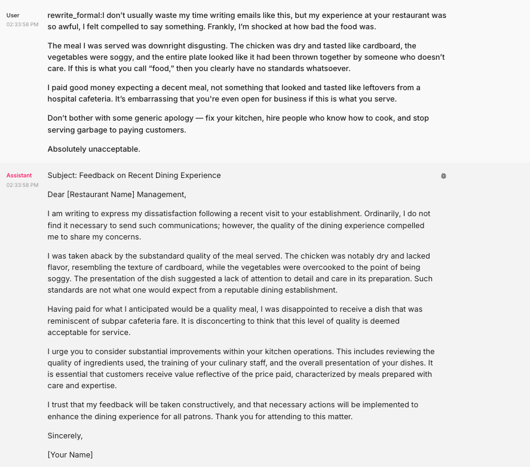

Activity #1 Vibe Checck

1. Explain the concept of object-oriented programming in simple terms to a complete beginner. 

2. Read the following paragraph and provide a concise summary of the key points…

3. Write a short, imaginative story (100–150 words) about a robot finding friendship in an unexpected place.

4. If a store sells apples in packs of 4 and oranges in packs of 3, how many packs of each do I need to buy to get exactly 12 apples and 9 oranges?

5. Rewrite the following paragraph in a professional, formal tone…

This "vibe check" now serves as a baseli